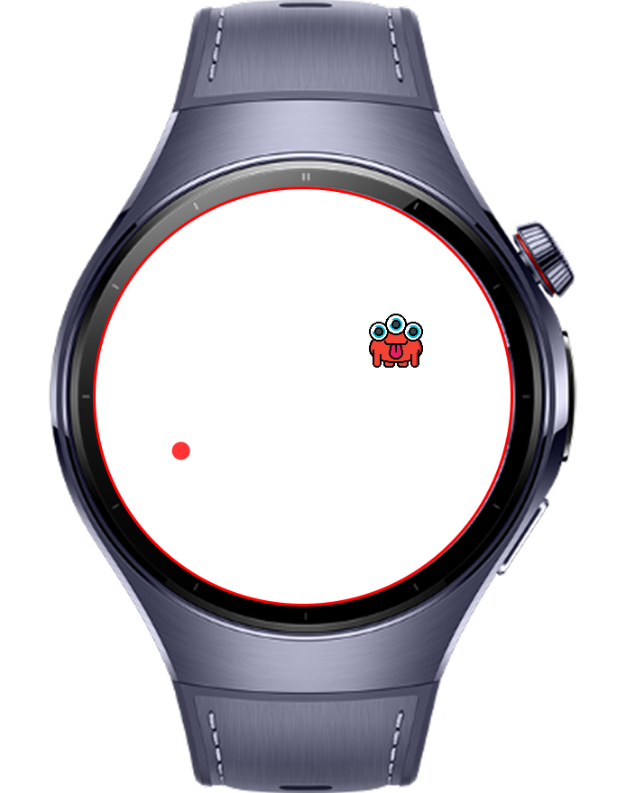
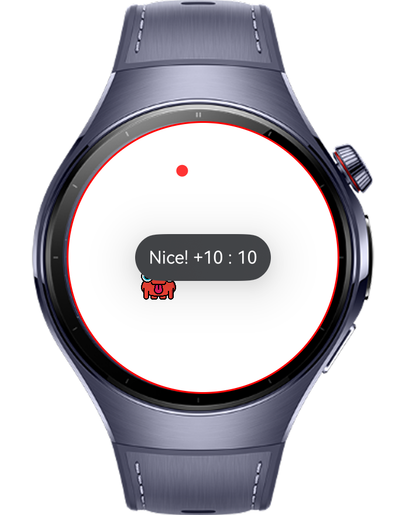
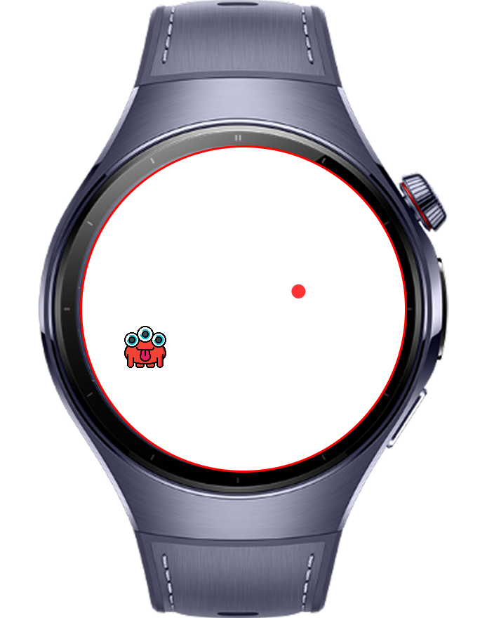
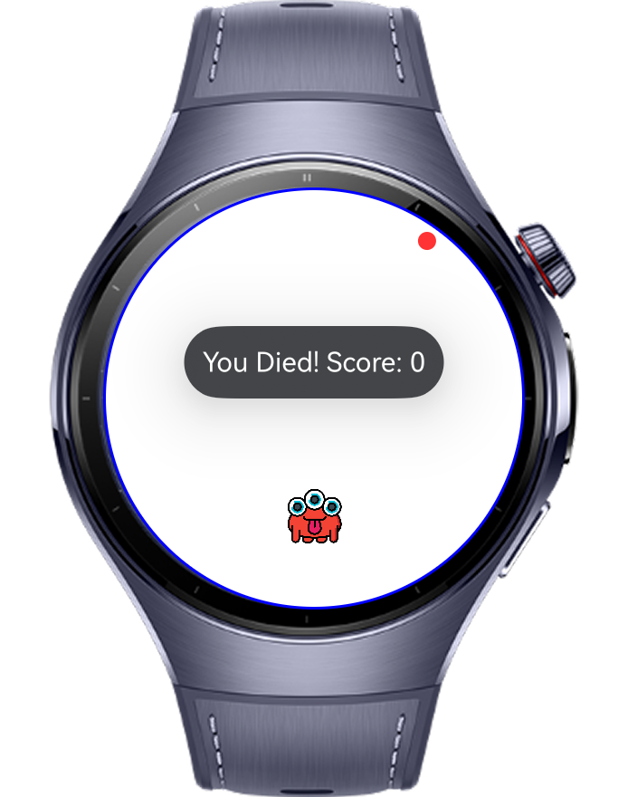

> **Note:** To access all shared projects, get information about environment setup, and view other guides, please visit [Explore-In-HMOS-Wearable Index](https://github.com/Explore-In-HMOS-Wearable/hmos-index).

# Shoot The Monster Game Application For Wearable

The Shoot The Monster game application is a game app built using gyroscope and accelerometer sensors, designed for Huawei watches.

# Preview

<div style="display: flex; width:'100%'; gap:12px;">
    
    
    
    
</div>

# Use Cases

1- Users try to aim at the monster by moving the red dot on the screen left, right, up, and down.
2- When the red dot aligns with the monster, the user taps the screen to make a successful shot, and each successful shot is worth 10 points.
3- After each successful shot, a new monster respawns in a different part of the screen.
4- If the user touches the red dot to the edges, the game ends.

# Tech Stack

- **Languages**: ArkTS/ArkUI
- **Frameworks**: HarmonyOS SDK 5.0.0.25
- **Tools**: DevEco Studio Vers 5.1.0.852
- **Libraries**:
    - `@kit.ArkUI`
    - `@kit.SensorKit`
    - `@ohos.diplay`

# Directory Structure

```
entry/src/main/ets/
|---pages
|---|---Index.ets
```

# Constraints and Restrictions

## Supported Devices
- Huawei Watch 5

# License
Shoot The Monster game Application is distributed under the terms of the MIT License
See the [LICENSE](./LICENSE) for more information.